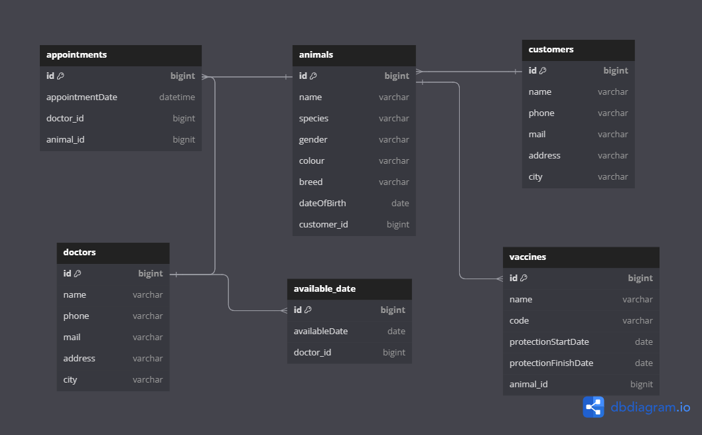
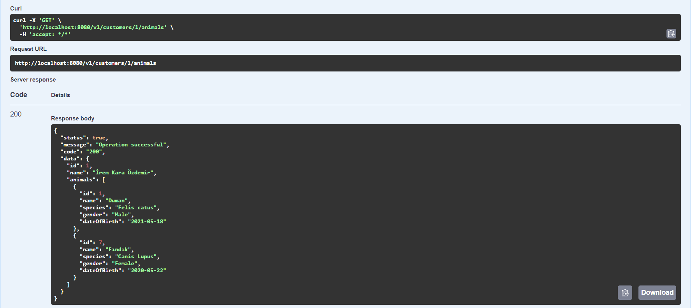
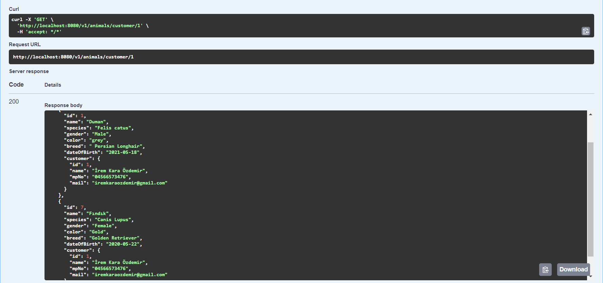
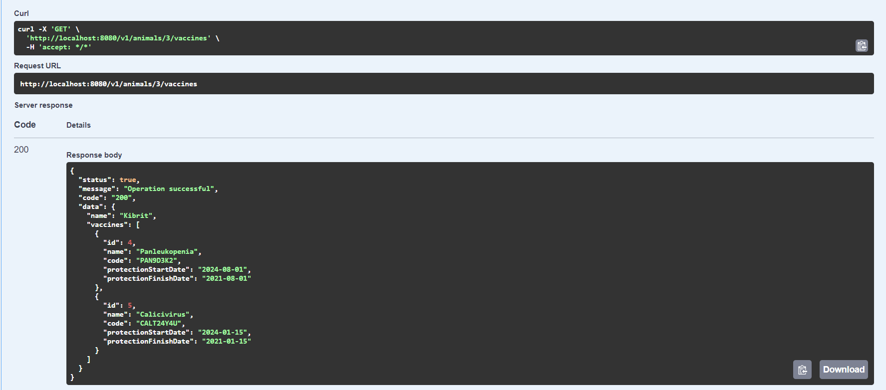
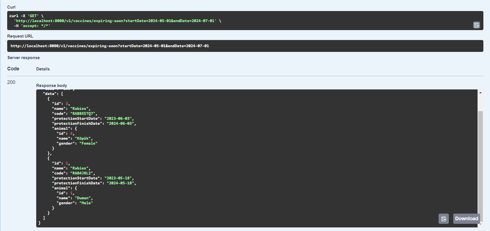
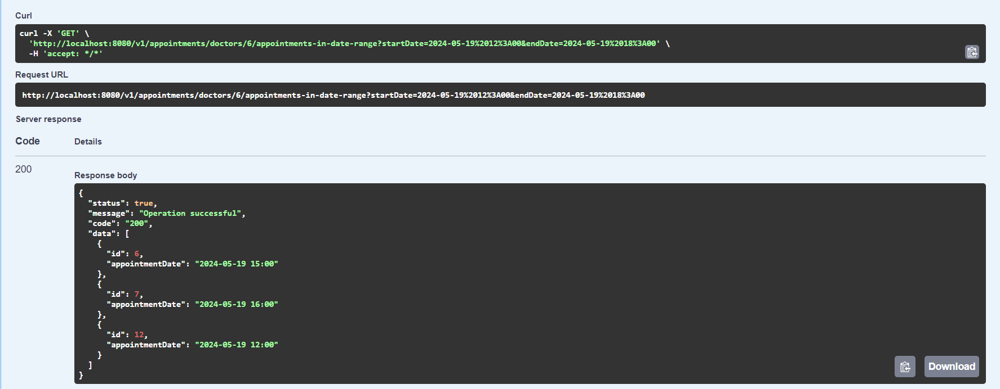
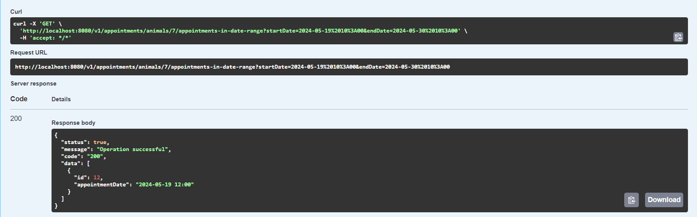

# Veterinary Management System


The Veterinary Management System is a REST API developed as part of the Patika+ Full Stack Web Development Bootcamp. The system efficiently manages CRUD operations for customers, doctors, animals, animal vaccines, and appointments.

## Technologies

 <a href="https://www.w3.org/html/" target="_blank" rel="noreferrer"  style="margin-right: 10px;"> 
 
</a> <a href="https://www.postgresql.org" target="_blank" rel="noreferrer"  style="margin-right: 10px;"> 
</a> <a href="https://postman.com" target="_blank" rel="noreferrer"  style="margin-right: 10px;">  
</a> <a href="https://spring.io/" target="_blank" rel="noreferrer"  style="margin-right: 10px;">  


</a>

## API Endpoints

| **Endpoint**                                                       | **HTTP Method** | **Description**                                                                                      |
|:-------------------------------------------------------------------|:---------------:|:-----------------------------------------------------------------------------------------------------|
| **customer**                                                       |                 |                                                                                                      |
| `/v1/customers`                                                    |       GET       | Retrieves all customers                                                                              |
| `/v1/customers`                                                    |       PUT       | Updates the customer with the given ID                                                               |
| `/v1/customers`                                                    |      POST       | Adds a new customer                                                                                  |
| `/v1/customers/{name}`                                             |       GET       | Retrieves the customer with the given name                                                           |
| `/v1/customers/customer/{id}`                                      |       GET       | Retrieves the customer with the given ID                                                             |
| `/v1/customers/{id}`                                               |     DELETE      | Deletes the customer with the given ID                                                               |
| `/v1/customers/{id}/animals`                                       |       GET       | Retrieves all animals belonging to the customer with the given ID.                                   |
|                                                                    |                 |                                                                                                      |
| **animal**                                                         |                 |                                                                                                      |
| `/v1/animals`                                                      |       GET       | Retrieves all animals                                                                                |
| `/v1/animals`                                                      |       PUT       | Updates the animal with the given ID                                                                 |
| `/v1/animals`                                                      |      POST       | Adds a new animal                                                                                    |
| `/v1/animals/{name}`                                               |       GET       | Retrieves the animal with the given name                                                             |
| `/v1/animals/{id}/vaccines`                                        |       GET       | Retrieves all vaccines received by the animal with the given ID.                                     |
| `/v1/animals/customer/{customerId}`                                |       GET       | Retrieves all animals belonging to the customer with the given ID.                                   |
| `/v1/animals/animal/{id}`                                          |       GET       | Retrieves the animal with the given ID                                                               |
| `/v1/animals/{id}`                                                 |     DELETE      | Deletes the animal with the given ID                                                                 |
|                                                                    |                 |                                                                                                      |
| **vaccine**                                                        |                 |                                                                                                      |
| `/v1/vaccines`                                                     |       GET       | Retrieves all vaccines the animals have received                                                     |
| `/v1/vaccines`                                                     |       PUT       | Updates the vaccine with the given ID                                                                |
| `/v1/vaccines`                                                     |      POST       | Adds a new vaccine received by the animal with the given ID                                          |
| `/v1/vaccines/{id}`                                                |       GET       | Retrieves the vaccine with the given ID                                                              |
| `/v1/vaccines/{id}`                                                |     DELETE      | Deletes the vaccine with the given ID                                                                |
| `/v1/vaccines/expiring-soon`                                       |       GET       | Retrieves vaccines with protection end dates between the given dates                                 |
|                                                                    |                 |                                                                                                      |
| **doctor**                                                         |                 |                                                                                                      |
| `/v1/doctors`                                                      |       GET       | Retrieves all doctors                                                                                |
| `/v1/doctors`                                                      |       PUT       | Updates the doctor with the given ID                                                                 |
| `/v1/doctors`                                                      |      POST       | Adds a new doctor                                                                                    |
| `/v1/doctors/{id}`                                                 |       GET       | Retrieves the doctor with the given ID                                                               |
| `/v1/doctors/{id}`                                                 |     DELETE      | Deletes the doctor with the given ID                                                                 |
|                                                                    |                 |                                                                                                      |
| **available_date**                                                 |                 |                                                                                                      |
| `/v1/available-dates`                                              |       GET       | Retrieves all available dates for doctors                                                            |
| `/v1/available-dates`                                              |       PUT       | Updates the available date with the given ID                                                         |
| `/v1/available-dates`                                              |      POST       | Adds a new available date                                                                            |
| `/v1/available-dates/{id}`                                         |       GET       | Retrieves the available date with the given ID                                                       |
| `/v1/available-dates/{id}`                                         |     DELETE      | Deletes the available date with the given ID                                                         |
|                                                                    |                 |                                                                                                      |
| **appointment**                                                    |                 |                                                                                                      |
| `/v1/appointments`                                                 |       GET       | Retrieves all appointments                                                                           |
| `/v1/appointments`                                                 |       PUT       | Updates the appointment with the given ID                                                            |
| `/v1/appointments`                                                 |      POST       | Adds a new appointment                                                                               |
| `/v1/appointments/{id}`                                            |       GET       | Retrieves the appointment with the given ID                                                          |
| `/v1/appointments/{id}`                                            |     DELETE      | Deletes the appointment with the given ID                                                            |
| `/v1/appointments/doctors/{doctorId}/appointments-in-date-range`   |       GET       | Retrieves the appointments of the doctor with the given ID that fall within the specified date range |
| `/v1/appointments/doctors/{doctorId}/appointments-in-date-range`   |       GET       | Retrieves the appointments of the animal with the given ID that fall within the specified date range |


## Installation

1. Make sure that at least Java 22.0.1 is installed on your system.
```bash
java -version
```
2. To clone the project repository, run the following command in the terminal:
```bash
   git clone https://github.com/ikaraozdemir/veterinary-app.git
   ```
3. Follow these steps to import the PostgreSQL backup file located inside the project folder:
    *  Navigate to the project folder in the terminal.
    * Import the PostgreSQL backup file:
   ```bash
   psql -U username -d database_name -f backup_file.sql
   ```
4. Before establishing the database connection, update the username and password in database.properties.

## Secreenshots
* UML Diagram
  

* All animals belonging to the customer with the given ID


* The animals are filtered by customer ID.


* All vaccines received by the animal with the given ID


* The vaccines with protection end dates between the given dates


* The appointments of the doctor with the given ID that fall within the specified date range


* The appointments of the animal with the given ID that fall within the specified date range
  

The link to the video where I briefly explain the project: 

## License

[MIT](https://choosealicense.com/licenses/mit/)
------------------------------------------------------------------------------------------------------
